# mini-react

에디터에 입력한 HTML을 임시 DOM으로 파싱해 Virtual DOM으로 바꾸고, 이전 트리와 비교해 변경점만 실제 DOM에 반영하는 mini React 프로젝트입니다.  
학습 과정에서는 두 가지 버전을 만들었습니다.

<p align="center">
  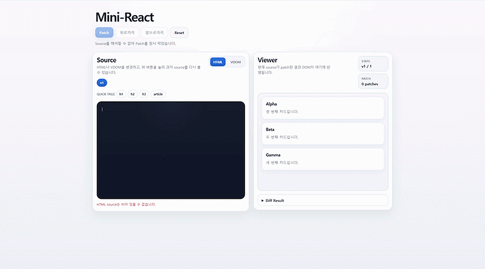
  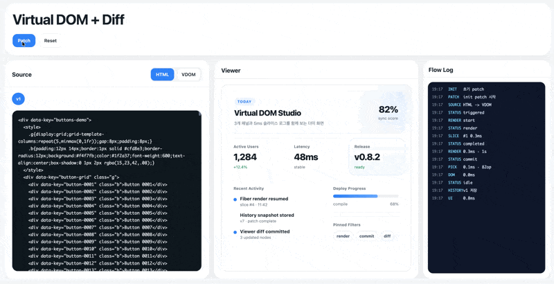
</p>

- 버전 1: `VNode` 트리를 재귀 DFS로 비교하는 가장 단순한 Diff 버전
- 버전 2: `Fiber`를 도입해 `render -> diff -> commit`을 분리하고, `MessageChannel`로 작업을 5ms 단위로 나눠 실행하는 버전

현재 브랜치 `mini-react-ver.2`는 **Fiber 버전 데모**를 담고 있습니다.

## 한눈에 보는 구조도

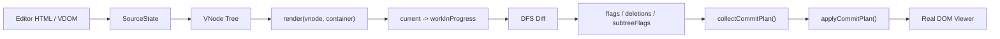

```text
입력 source
  -> VNode 생성
  -> workInProgress Fiber 생성
  -> 이전 Fiber와 비교
  -> 변경 플래그 기록
  -> commit plan 수집
  -> 실제 DOM 반영
```

## 프로젝트 목표

- React의 핵심 개념인 Virtual DOM과 Diff 알고리즘 이해
- 브라우저 DOM을 읽어 `VNode`로 변환
- 이전 트리와 새 트리를 비교해 변경점만 찾아내기
- `Fiber`를 통해 render 작업을 잘게 나누고 commit 단계와 분리하기

## 데모가 보여주는 것

데모 페이지는 세 패널로 구성됩니다.

- 왼쪽: HTML / VDOM source editor
- 가운데: patch 결과가 반영된 viewer
- 오른쪽: render / commit 흐름과 시간 로그

동작 순서는 다음과 같습니다.

1. 사용자가 HTML 또는 VDOM source를 수정합니다.
2. `Patch`를 누르면 source를 새 `VNode` 루트로 만듭니다.
3. 이전 `Fiber` 트리와 비교하며 새 `workInProgress` Fiber 트리를 만듭니다.
4. 변경 사항을 `Placement`, `Update`, `Deletion`으로 기록합니다.
5. commit 단계에서 실제 DOM에 필요한 작업만 반영합니다.
6. history 탭에 source 스냅샷을 저장합니다.

## 버전 1과 버전 2의 차이

### 버전 1

- `VNode` 트리를 재귀적으로 내려가며 비교합니다.
- 구현은 단순하지만 전체 과정이 동기 처리입니다.
- 트리가 커지면 JavaScript가 메인 스레드를 오래 점유해 브라우저가 버벅이기 쉽습니다.

### 버전 2

- `Fiber`를 도입해 작업 단위를 노드 단위로 쪼갭니다.
- `render`와 `commit`을 분리합니다.
- `MessageChannel`로 다음 task를 예약해 render를 5ms 단위로 끊어 실행합니다.
- `subtreeFlags`를 사용해 commit 단계에서 변경 없는 subtree 탐색을 줄입니다.

## 현재 구현의 전체 흐름

현재 구현은 **실제 React의 `setState` 기반 update queue**를 그대로 복제한 것은 아닙니다.  
이 데모는 사용자가 입력한 **새 HTML 또는 VDOM 전체를 새 루트 입력**으로 보고, 그 루트부터 이전 트리와 비교합니다.

흐름은 다음과 같습니다.

1. HTML source면 문자열을 임시 DOM으로 파싱합니다.
2. 임시 DOM을 읽어 `VNode` 트리를 만듭니다.
3. `render(vnode, container)`가 호출됩니다.
4. `root.current.updateQueue = [element]`로 이번 렌더의 새 루트 입력을 기록합니다.
5. `scheduleUpdateOnRoot()`가 `current`를 기준으로 `workInProgress` 루트를 만듭니다.
6. `MessageChannel`이 다음 task에서 `performWorkUntilDeadline()`를 실행합니다.
7. `workLoop()`가 DFS로 `Fiber`를 하나씩 처리합니다.
8. `reconcileChildren()`가 이전 `Fiber`와 새 `VNode`를 비교해 flags를 남깁니다.
9. `completeWork()`가 DOM 노드를 미리 준비하고 `subtreeFlags`를 부모로 올립니다.
10. render가 끝나면 `commitRoot()`가 commit plan을 만들고 실제 DOM을 반영합니다.
11. 커밋이 끝나면 `workInProgress`가 새 `current`가 됩니다.

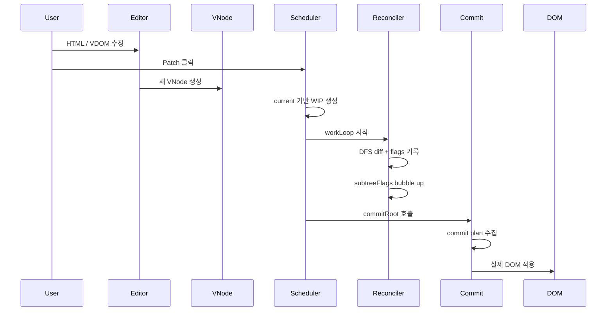

## HTML source에서 VNode를 만드는 방식

HTML 모드에서는 문자열을 바로 `VNode`로 바꾸지 않습니다.  
먼저 브라우저가 이해할 수 있는 **임시 DOM**으로 한 번 파싱한 뒤, 그 DOM을 읽어 `VNode`를 만듭니다.

순서는 다음과 같습니다.

1. source HTML 문자열 읽기
2. `template.innerHTML = sourceHtml`
3. `template.content`에서 root element 추출
4. 그 element를 재귀적으로 읽어 `VNode` 생성

즉 흐름은 아래와 같습니다.

`HTML 문자열 -> 임시 DOM -> VNode`

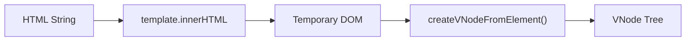

```text
<div class="card">hello</div>
  -> template.innerHTML
  -> Element 노드 생성
  -> tag / props / children 읽기
  -> VNode 생성
```

관련 파일:

- [/Users/woonyong/workspace/Krafton-Jungle/jungle-week4-react/src/index.ts](/Users/woonyong/workspace/Krafton-Jungle/jungle-week4-react/src/index.ts)
- [/Users/woonyong/workspace/Krafton-Jungle/jungle-week4-react/src/vdom/from-dom.ts](/Users/woonyong/workspace/Krafton-Jungle/jungle-week4-react/src/vdom/from-dom.ts)

## VNode와 Fiber의 차이

### VNode

`VNode`는 화면의 모양을 설명하는 **설계도**입니다.

- 어떤 태그인지
- 어떤 props를 가지는지
- 어떤 자식을 가지는지

같은 정보만 담습니다.

### Fiber

`Fiber`는 렌더링을 위한 **런타임 작업 단위**입니다.

- 이전 트리와 연결하는 `alternate`
- 부모 / 자식 / 형제 포인터
- 실제 DOM 참조 `stateNode`
- commit용 `flags`
- 자식 subtree 요약인 `subtreeFlags`

즉 현재 구현은 **새 VNode 입력**과 **이전 Fiber 트리**를 비교해  
**변경 정보가 들어 있는 새 Fiber 트리**를 만드는 구조입니다.

```text
VNode
  - 화면의 모양을 설명하는 설계도
  - tag, props, children 중심

Fiber
  - 렌더링 작업 단위
  - alternate, child, sibling, return, stateNode, flags 보유
```

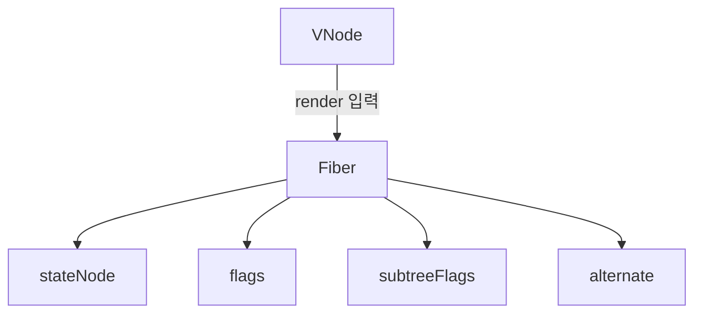

관련 파일:

- [/Users/woonyong/workspace/Krafton-Jungle/jungle-week4-react/src/vdom/element-node.ts](/Users/woonyong/workspace/Krafton-Jungle/jungle-week4-react/src/vdom/element-node.ts)
- [/Users/woonyong/workspace/Krafton-Jungle/jungle-week4-react/src/vdom/text-node.ts](/Users/woonyong/workspace/Krafton-Jungle/jungle-week4-react/src/vdom/text-node.ts)
- [/Users/woonyong/workspace/Krafton-Jungle/jungle-week4-react/src/vdom/fiber.ts](/Users/woonyong/workspace/Krafton-Jungle/jungle-week4-react/src/vdom/fiber.ts)

## workInProgress의 역할

`workInProgress`는 **다음 화면을 계산하기 위한 초안 트리**입니다.

- `current`: 지금 실제 화면에 붙어 있는 확정본
- `workInProgress`: 다음 화면을 만들기 위해 계산 중인 초안

왜 필요한가:

- 새 화면을 계산하는 동안 현재 화면이 깨지면 안 됩니다.
- 그래서 `current`는 그대로 두고, `workInProgress`에서만 flags와 DOM 준비를 진행합니다.
- commit이 끝나면 `workInProgress`가 새 `current`가 됩니다.

이 구조는 더블 버퍼링과 비슷합니다.

```text
current
  - 지금 화면에 붙어 있는 확정본

workInProgress
  - 다음 화면을 계산하는 초안

commit 후
  workInProgress -> current
```

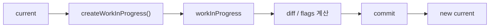

## Diff 알고리즘

Diff의 핵심은 `reconcileChildren()`입니다.

현재 구현은 다음 기준으로 같은 노드인지 판단합니다.

- `key`가 있으면 `key` 우선
- `key`가 없으면 내부 `uid` 사용
- `type`도 같아야 같은 노드로 봄

비교 결과는 다음 세 가지 effect로 기록됩니다.

- `Placement`: 새 삽입 또는 이동 필요
- `Update`: 기존 DOM 재사용 + 속성/텍스트 수정 필요
- `Deletion`: 기존 DOM 제거 필요

삭제는 자식 자신에게 두지 않고 **부모의 `deletions` 목록**에 모읍니다.

```text
비교 결과
  같은 노드 + props 다름 -> Update
  새 노드 -> Placement
  사라진 old 노드 -> 부모 deletions
```

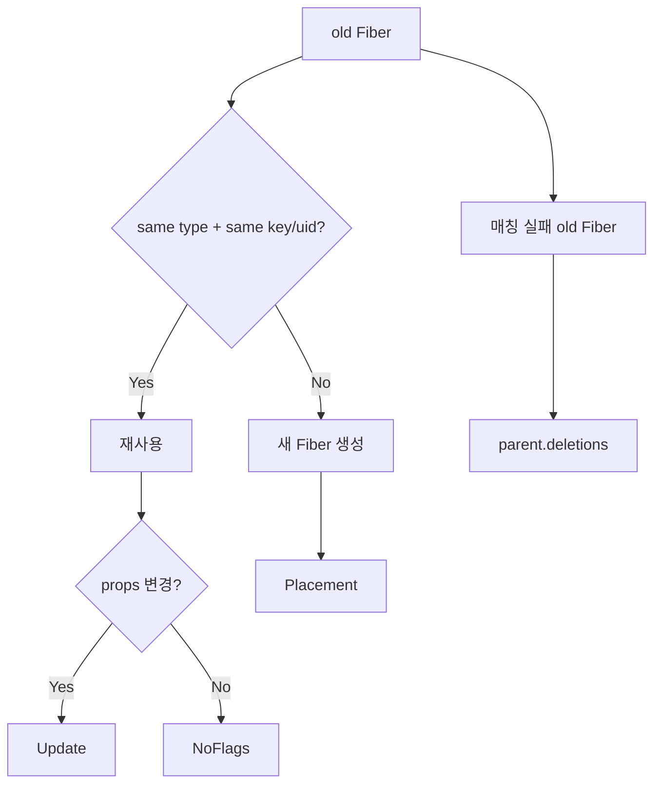

관련 파일:

- [/Users/woonyong/workspace/Krafton-Jungle/jungle-week4-react/src/vdom/reconciler.ts](/Users/woonyong/workspace/Krafton-Jungle/jungle-week4-react/src/vdom/reconciler.ts)

## DFS로 Fiber를 처리하는 방식

render phase는 DFS로 동작합니다.

1. 현재 Fiber를 처리합니다.
2. 자식이 있으면 자식으로 내려갑니다.
3. 자식이 없으면 형제로 이동합니다.
4. 형제도 없으면 부모로 올라갑니다.

즉 순회 규칙은:

`자식 -> 형제 -> 부모의 형제`

입니다.

이 과정에서:

- 내려가면서: 현재 노드의 `flags`를 기록
- 올라오면서: 자식들의 effect를 부모 `subtreeFlags`로 집계

합니다.

```text
DFS 규칙
  1. 자식이 있으면 자식으로
  2. 자식이 없으면 형제로
  3. 형제도 없으면 부모로 올라감

render 중
  내려갈 때: flags 기록
  올라올 때: subtreeFlags 집계
```

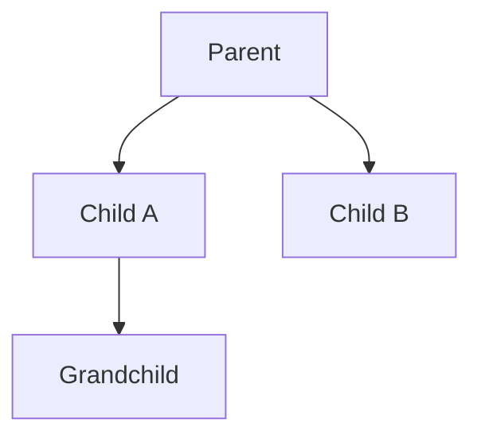

```text
순회 예시
Parent
  -> Child A
  -> Grandchild
  -> Child B
  -> Parent로 복귀
```

## subtreeFlags는 어떻게 동작하는가

`subtreeFlags`는 **이 노드 아래 subtree에 commit할 effect가 있는지** 부모가 빠르게 알기 위한 요약 정보입니다.

현재 구현에서는 자식 처리가 끝나고 부모로 돌아올 때 아래 연산을 합니다.

```ts
subtreeFlags |= child.flags;
subtreeFlags |= child.subtreeFlags;
```

의미:

- `child.flags`: 자식 자신이 바뀌었는가
- `child.subtreeFlags`: 자식 아래 더 깊은 곳이 바뀌었는가

즉 부모는 자식들을 훑으면서 자기 `subtreeFlags`를 계산합니다.  
변경을 발견한 순간 곧바로 모든 부모에 즉시 전파하는 방식은 아닙니다.  
**DFS가 되돌아오면서 bubble up 하는 방식**입니다.

예를 들어 `C`가 바뀌면:

- `C.flags = Update`
- `B.subtreeFlags = Update`
- `A.subtreeFlags = Update`

형태로 올라갑니다.

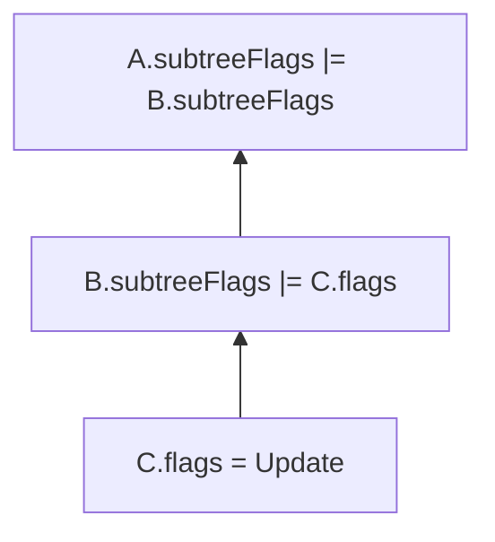

```text
내려가며
  C.flags = Update

올라오며
  B.subtreeFlags |= C.flags
  A.subtreeFlags |= B.subtreeFlags
```

## commit 단계

commit 단계는 render 단계와 다릅니다.

- render: 무엇을 바꿀지 계산
- commit: 계산한 변경을 실제 DOM에 적용

현재 commit은 두 단계로 나뉩니다.

1. `collectCommitPlan()`
   - 삭제 / 삽입 / 수정 액션을 수집
2. `applyCommitPlan()`
   - `appendChild`, `insertBefore`, `removeChild`, 속성 수정 호출

중요한 점:

- DOM node 객체 생성은 render의 `completeWork()`에서 미리 준비합니다.
- 실제 live DOM에 붙이는 것은 commit에서 합니다.

즉:

- render에서 DOM 노드를 **준비**
- commit에서 실제 document에 **반영**

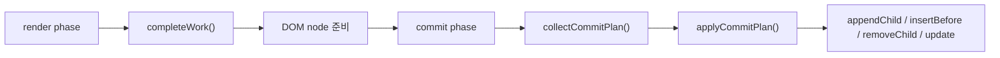

```text
render
  - 무엇을 바꿀지 계산
  - DOM node를 미리 준비

commit
  - 실제 DOM API 호출
  - 화면 반영
```

관련 파일:

- [/Users/woonyong/workspace/Krafton-Jungle/jungle-week4-react/src/vdom/dom.ts](/Users/woonyong/workspace/Krafton-Jungle/jungle-week4-react/src/vdom/dom.ts)

## subtreeFlags가 commit 탐색을 줄이는 방식

현재 버전에서 `subtreeFlags`는 **render skip**이 아니라 **commit 탐색 skip**에 사용됩니다.

commit plan을 모을 때 아래 조건을 봅니다.

- `fiber.flags !== NoFlags`
- `fiber.subtreeFlags !== NoFlags`
- `fiber.deletions !== null`

셋 다 아니면 그 subtree는 실제 변경이 없다고 보고 내려가지 않습니다.

즉 이전에는 finishedWork 전체를 DFS로 돌았지만,  
지금은 **변경이 표시된 가지 위주로 commit plan을 수집**합니다.

```text
commit 탐색 조건
  fiber.flags !== NoFlags
  || fiber.subtreeFlags !== NoFlags
  || fiber.deletions !== null

셋 다 false면
  -> 이 subtree는 건너뜀
```

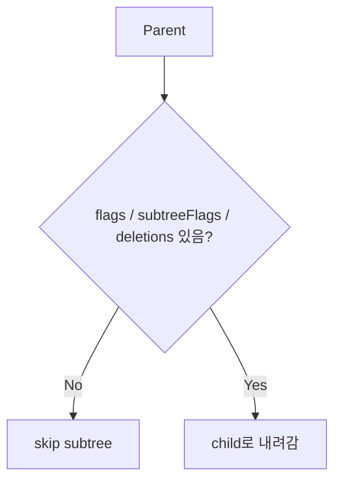

## 왜 5ms 단위로 작업을 나누는가

브라우저의 렌더링과 JavaScript는 같은 메인 스레드를 사용합니다.  
JavaScript가 오랫동안 스레드를 점유하면 화면이 멈춘 것처럼 보입니다.

그래서 현재 구현은 한 번에 끝까지 계산하지 않고:

1. `MessageChannel`로 다음 task를 예약하고
2. 한 번에 최대 5ms만 render를 진행한 뒤
3. 제어권을 브라우저에 돌려주고
4. 다음 task에서 다시 이어서 실행합니다

이 방식은 **진짜 백그라운드 스레드**가 아니라,  
**메인 스레드 작업을 잘게 나눠 재예약하는 협력적 스케줄링**입니다.

60fps 기준 한 프레임은 약 16.6ms입니다.  
현재 구현은 그중 일부만 JavaScript가 쓰고, 나머지 시간을 브라우저 렌더링에 돌려주려는 의도입니다.

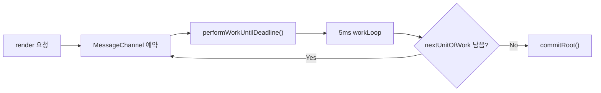

```text
한 번에 끝까지 하지 않고
  5ms 작업
  -> 브라우저에 제어권 반환
  -> 다음 task에서 재개
```

관련 파일:

- [/Users/woonyong/workspace/Krafton-Jungle/jungle-week4-react/src/vdom/scheduler.ts](/Users/woonyong/workspace/Krafton-Jungle/jungle-week4-react/src/vdom/scheduler.ts)

## 실제 React와 현재 데모의 차이

발표에서 가장 조심해야 하는 부분입니다.

### 현재 데모

- 사용자가 입력한 HTML 또는 VDOM 전체를 새 루트 입력으로 사용
- root부터 이전 Fiber와 새 VNode를 비교
- `MessageChannel`로 render를 5ms 단위로 나눔
- `subtreeFlags`로 commit 탐색 최적화

### 실제 React

- `setState`가 Fiber / Hook의 update queue에 쌓임
- 업데이트 정보가 root까지 전파됨
- render는 여전히 Fiber 기반이지만, 필요한 subtree만 다시 계산
- `lanes`, `childLanes` 등으로 render skip 가능
- `flags`, `subtreeFlags`로 commit 대상 subtree를 줄임

즉 현재 데모는 **React의 전체 상태 시스템을 구현한 것**이 아니라,  
**Virtual DOM, Diff, Fiber, render/commit 분리, time slicing의 핵심 아이디어를 최소 구현으로 보여주는 프로젝트**입니다.

실제 React 참고:

- [Queueing a Series of State Updates](https://react.dev/learn/queueing-a-series-of-state-updates)
- [startTransition](https://react.dev/reference/react/startTransition)
- [ReactFiberBeginWork.js](https://github.com/facebook/react/blob/main/packages/react-reconciler/src/ReactFiberBeginWork.js)

## 발표용 설명 문장 정리

발표에서는 아래처럼 설명하는 것이 현재 코드와 가장 잘 맞습니다.

### 프로젝트 소개

저희는 React의 Virtual DOM과 Diff를 이해하기 위해, 최소한의 구현부터 시작해 점진적으로 기능을 추가하는 방식으로 학습했습니다.  
학습 과정에서는 두 가지 버전을 만들었고, 현재 발표에서는 Fiber를 적용한 두 번째 버전을 중심으로 설명합니다.

### 버전 1

첫 번째 버전은 `VNode` 트리를 만들고, 재귀 DFS로 이전 트리와 새 트리를 비교하는 가장 단순한 Diff 구현입니다.

### 버전 2

두 번째 버전은 `Fiber`를 도입해 render와 commit을 분리했습니다.  
이 버전에서는 새 source에서 만든 `VNode`를 바로 DOM에 반영하지 않고, 먼저 `Fiber` 작업 단위로 바꿔 변경 사항을 기록한 뒤 commit 단계에서 실제 DOM을 수정합니다.

### 현재 데모의 시작점

현재 데모는 실제 React처럼 `setState` 기반 update queue에서 시작하지 않습니다.  
대신 사용자가 작성한 HTML 또는 VDOM 전체를 새 루트 입력으로 보고, 그 입력을 기준으로 새 `VNode`와 `Fiber` 트리를 만듭니다.

### render phase

render phase에서는 DFS로 Fiber를 하나씩 처리하며 이전 Fiber와 새 VNode를 비교합니다.  
이 과정에서 `Placement`, `Update`, `Deletion` 같은 effect flags를 기록합니다.

### subtreeFlags

자식 처리가 끝나고 부모로 올라올 때는 자식들의 `flags`와 `subtreeFlags`를 OR 연산으로 합쳐 부모 `subtreeFlags`에 기록합니다.  
이 덕분에 commit 단계에서는 변경 없는 subtree를 통째로 건너뛸 수 있습니다.

### time slicing

render phase는 `MessageChannel`을 이용해 5ms 단위로 끊어서 실행합니다.  
이유는 JavaScript가 메인 스레드를 오래 점유하면 브라우저 렌더링이 멈추기 때문입니다.  
즉 백그라운드 스레드를 쓰는 것이 아니라, 메인 스레드 작업을 잘게 나눠 브라우저에 제어권을 자주 돌려주는 방식입니다.

### commit phase

commit phase에서는 render에서 계산한 effect를 실제 DOM에 반영합니다.  
이 단계에서 `appendChild`, `insertBefore`, `removeChild`, 속성 수정이 실제로 호출됩니다.

### 정리

이 프로젝트를 통해 Virtual DOM과 Diff의 기본 원리, Fiber의 역할, render와 commit 분리, 그리고 작업을 잘게 나눠 브라우저 응답성을 지키는 방식을 학습했습니다.

## 실행 방법

### 가장 간단한 실행

```bash
make dev
```

브라우저에서 아래 주소를 열면 됩니다.

```text
http://127.0.0.1:4173/index.html
```

### 개별 실행

```bash
make watch
make serve
```

### 검증

```bash
npm run typecheck
npm run build
```

## 주요 파일

- [/Users/woonyong/workspace/Krafton-Jungle/jungle-week4-react/src/index.ts](/Users/woonyong/workspace/Krafton-Jungle/jungle-week4-react/src/index.ts)
- [/Users/woonyong/workspace/Krafton-Jungle/jungle-week4-react/src/vdom/from-dom.ts](/Users/woonyong/workspace/Krafton-Jungle/jungle-week4-react/src/vdom/from-dom.ts)
- [/Users/woonyong/workspace/Krafton-Jungle/jungle-week4-react/src/vdom/fiber.ts](/Users/woonyong/workspace/Krafton-Jungle/jungle-week4-react/src/vdom/fiber.ts)
- [/Users/woonyong/workspace/Krafton-Jungle/jungle-week4-react/src/vdom/scheduler.ts](/Users/woonyong/workspace/Krafton-Jungle/jungle-week4-react/src/vdom/scheduler.ts)
- [/Users/woonyong/workspace/Krafton-Jungle/jungle-week4-react/src/vdom/reconciler.ts](/Users/woonyong/workspace/Krafton-Jungle/jungle-week4-react/src/vdom/reconciler.ts)
- [/Users/woonyong/workspace/Krafton-Jungle/jungle-week4-react/src/vdom/dom.ts](/Users/woonyong/workspace/Krafton-Jungle/jungle-week4-react/src/vdom/dom.ts)
- [/Users/woonyong/workspace/Krafton-Jungle/jungle-week4-react/index.html](/Users/woonyong/workspace/Krafton-Jungle/jungle-week4-react/index.html)
